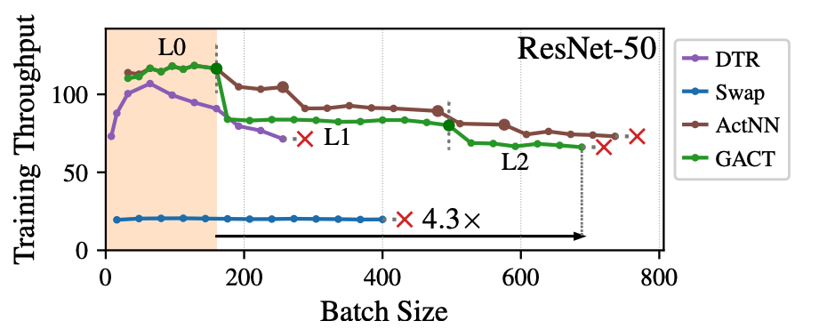
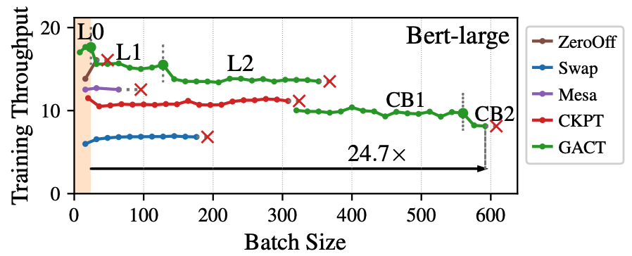
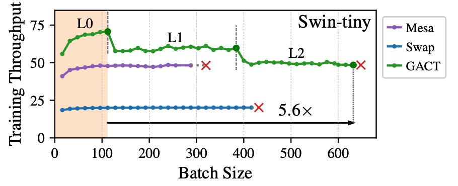

# GACT: Activation Compressed Training for General Architectures
This is the official project repository for [GACT: Activation Compressed Training for General Architectures](https://arxiv.org/abs/2206.11357) by Xiaoxuan Liu, Lianmin Zheng, Dequan Wang, Yukuo Cen, Weize Chen, Xu Han, Jianfei Chen, Zhiyuan Liu, Jie Tang, Joey Gonzalez, Michael Mahoney, Alvin Cheung.

GACT is a PyTorch library for memory-efficient training for general network architectures. It reduces the training memory footprint by compressing the saved activations. It will get the layer sensitivity automatically during training and assign quantization bits accordingly. It can work with any network architecture and apply to a wide range of deep learning tasks, including CV, NLP, and Graph NN.

## Abstract
Training large neural network (NN) models requires extensive memory resources, and Activation Compressed Training (ACT) is a promising approach to reduce training memory footprint. This paper presents GACT, an ACT framework to support a broad range of machine learning tasks for generic NN architectures with limited domain knowledge. By analyzing a linearized version of ACT's approximate gradient, we prove the convergence of GACT without prior knowledge on operator type or model architecture. To make training stable, we propose an algorithm that decides the compression ratio for each tensor by estimating its impact on the gradient at run time. We implement GACT as a PyTorch library that readily applies to any NN architecture. GACT reduces the activation memory for convolutional NNs, transformers, and graph NNs by up to 8.1x, enabling training with a 4.2x to 24.7x larger batch size, with negligible accuracy loss.

<!--  -->

<!--  -->

## Install
- Requirements
```
torch==1.10.1
```
GPU and CUDA Toolkit are required.

- Build
```bash
cd gact
pip install -v -e .
```

## Usage
```python
from gact.controller import Controller # import gact controller
gact.set_optimization_level('L2') # set optmization level, more config info can be seen in gact/conf.py
model = .... # define your model here
controller = Controller(model)
controller.install_hook()

# training logic
for epoch in ...
  for iter in ....
    ......
    def backprop():
        model.train() # make sure you are in the training mode
        output = model(input) # forward
        loss = calculate_loss()
        optimizer.zero_grad() # this line must be present!
        loss.backward() # backward

    optimizer.step() # update the parameters
    controller.iterate(backprop) # tell gact how to perform forward/backward

controller.uninstall_hook()
```
## Examples
`./benchmark` directory includes the four benchmarks we test in the paper ([GNN](https://github.com/LiuXiaoxuanPKU/GACT-ICML/tree/release_v6/benchmark/gnn), [Vision](https://github.com/LiuXiaoxuanPKU/GACT-ICML/tree/release_v6/benchmark/vision), [Vision transformer](https://github.com/LiuXiaoxuanPKU/GACT-ICML/tree/release_v6/benchmark/Swin-Transformer), and [Bert](https://github.com/LiuXiaoxuanPKU/GACT-ICML/tree/release_v6/benchmark/text_classification)). Please refer to each sub directory for more details. The fastest bechmark to play with is GCN bechmark. Under `./benchmark/gnn` directory, you can easily compare the accuracy with

```
# make sure you are under ./benchmark/gnn 
# train with full precision
python test_gnn.py --model ARCH

# train with GACT LEVEL
python test_gnn.py --model ARCH --gact --level LEVEL
```

The choices for ARCH are {gcn, sage, gat}

The choices for LEVEL are {L1, L1.1, L1.2, L2, L2.1, L2.2, L3}

To compare the memory,
```
# Get the memory information with full precision
python test_gnn.py --model ARCH --get-mem

# Get the memory information with GACT LEVEL
python test_gnn.py --model ARCH --gact --level LEVEL --get-mem
```

The choices for ARCH are {gcn, sage, gat}

The choices for LEVEL are {L1, L1.1, L1.2, L2, L2.1, L2.2, L3}
